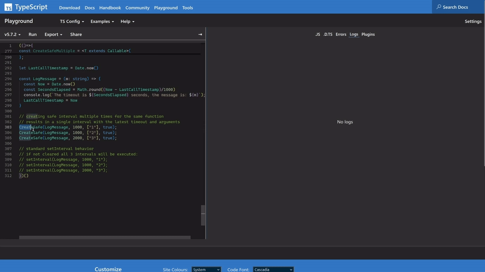
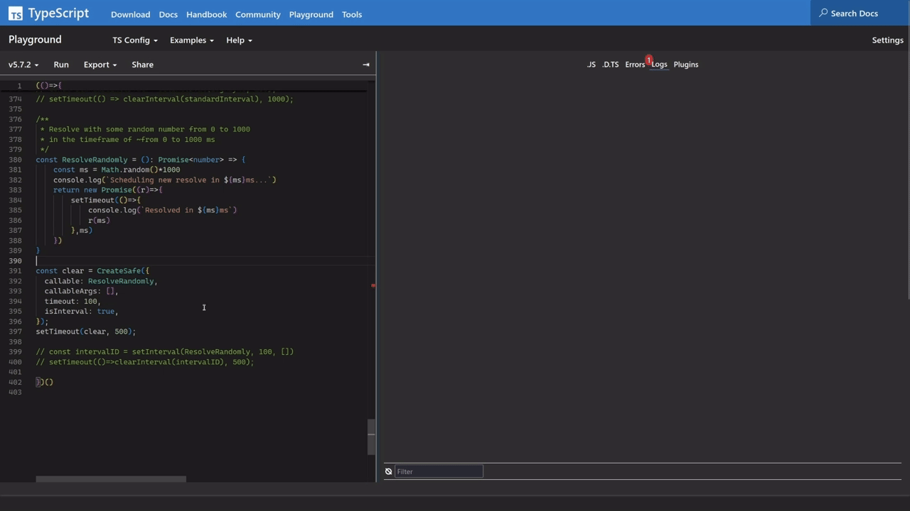
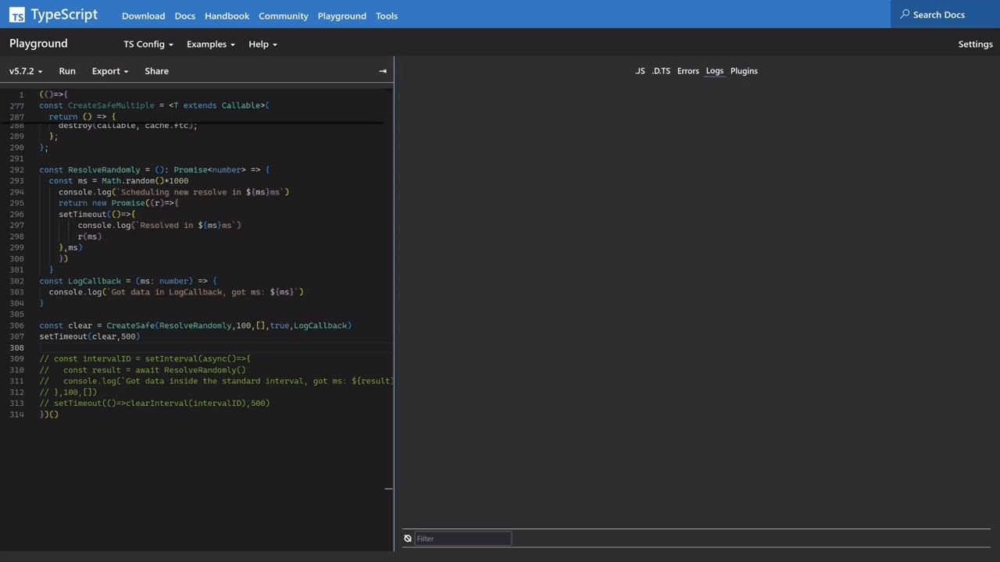

# Safe Interval

Create intervals with predictable async operations start/resolve order and without
fear of registering an interval for the same operation multiple times. See the
[**differences with the standard setInterval**](#differences-with-standard-setinterval) section for more information.

**Useful:**

- to ensure no shuffling of a function invocations and resolved results (like if an async function was not done yet but has been called again and this time finished before the first one)
- to setup only one interval or timeout for the same function
- to reregister the managed function with new arguments/timeout/callback without clearing previous interval/timeout
- to work with the results of the managed function providing a callback to avoid the need to reference the callback in the function itself
- to prevent scheduled function calls to be executed see [Clearing the queue](#clearing-the-queue) subsection

## Installation

To use with node:

```bash
npm install safe-interval
```

To use directly in the browser:

```html
<script src="path/to/yourCopyOf/safe-interval.js"></script>
```

## Usage

Import all methods at once:

```javascript
import * as SafeInterval from "safe-interval";
```

Or pick needed methods:

```javascript
import { CreateSafe } from "safe-interval";
```

Create an interval:

```typescript
const clear = CreateSafe({
  callable: SomeFunction, // this will be called
  callableArgs: [1, 2, "hello"], // with these arguments
  timeout: 1000, // every ~1 second + resolve time of the previous calls if SomeFunction is async
  isInterval: true, // this is an interval
});
clear(); // this will clear the interval
```

Create a timeout:

```typescript
CreateSafe({
  callable: SomeFunction, // this will be called
  callableArgs: [1, 2, "hello"], // with these arguments
  timeout: 1000, // once after ~1 second
  isInterval: false, // this is a timeout
});
```

Create multiple intervals for the same function:

```typescript
const clear1 = CreateSafeMultiple({
  callable: SomeFunction, // this will be called
  callableArgs: [1, 2, "hello"], // with these arguments
  timeout: 1000, // after ~1 second + resolve time of the previous calls if SomeFunction is async
  isInterval: true, // this is an interval
});
const clear2 = CreateSafeMultiple({
  callable: SomeFunction, // this will be called
  callableArgs: [3, 1, "bye"], // with these arguments
  timeout: 1000, // after ~1 second + resolve time of the previous calls if SomeFunction is async
  isInterval: true, // this is an interval
});
// both intervals are independent
clear1(); // clears the first interval
clear2(); // clears the second interval
```

Create multiple timeouts for the same function:

```typescript
CreateSafeMultiple({
  callable: SomeFunction, // this will be called
  callableArgs: [1, 2, "hello"], // with these arguments
  timeout: 1000, // once after ~1 second
  isInterval: false, // this is a timeout
});
CreateSafeMultiple({
  callable: SomeFunction, // this will be called
  callableArgs: [3, 1, "bye"], // with these arguments
  timeout: 1000, // once after ~1 second
  isInterval: false, // this is a timeout
});
// both timeouts are independent
```

## Parameters explanation

Arguments are passed into the CreateSafe and CreateSafeMultiple functions in
the form of an object with these fields:

- **callable**: Function to be called at each interval or timeout.
- **callableArgs**: Arguments for the called function in the form of an array.
- **isInterval**: If true, an interval is created.
- **timeout**: Interval/timeout duration in milliseconds.
- **cb**: Optional callback function to be called with the result of the callable.
- **removeQueue**: If true, the queue of the callable is removed, see [Clearing the queue](#clearing-the-queue) subsection below.

## Special behaviors explanation

### ReRegistering the function

**Is applied only with CreateSafe method.** If a function is
registered with CreateSafe and then the same function is registered again (even with different arguments or timeout), there will be only one interval
managing such function and the arguments/timeout will be the last ones passed to
the CreateSafe method. See [ReRegistering demo](#reregistering).

### Clearing the queue

The _removeQueue_ flag passed to CreateSafe or CreateSafeMultiple will inform the
methods to clear the queue for the associated function in such cases:

- the clear function (the one which is returned from the CreateSafe or
  CreateSafeMultiple methods) is called
- a reregister happened

CreateSafe and CreateSafeMultiple don't add the functions which they manage directly to the stack but maintain a queue for each function. If such queue has
any queued callables then the special loop pulls the first one from the queue, pushes it to the stack, waits for it's resolve and calls an associated callback if any, only then it will pull the next callable from the queue.

This practically means that if an interval has pushed many calls to the queue but
they haven't all resolved yet and the clear function is called or a reregister happens => then all callables in the queue will be eliminated without being actually called (provided the _removeQueue_ flag is set to true).

See [Option to clear the queue](#option-to-clear-the-queue-of-async-calls) demo below.

### Differences between CreateSafe and CreateSafeMultiple

Use CreateSafeMultiple if there is a need to setup multiple intervals/timeouts for the same callable.

For example, if there is a need to fetch multiple different resources periodically, or the same resource but with different timeouts.

Every call to CreateSafeMultiple function creates a new interval/timeout for the callable.

Characteristics which remain from CreateSafe are:

- no shuffling of the callable invocations and resolved results (inside the same interval)
- special clear function
- can accept a callback

Not like CreateSafe:

- creates interval/timeout for the same callable each time allowing for not related intervals/timeouts calling the same callable (no matter the arguments, timeout)
- there is no closure over the cache here so each call creates a new cache and the calls are not related through the cache or by any other means

## Differences with standard setInterval

This section is here to show the main differences in using CreateSafe over standard setInterval. Each example has a gif preview which is clickable. Upon click a mp4 demo should open (useful to make pauses if needed).

### ReRegistering

Creating safe interval multiple times for the same function
results in a single interval with the latest timeout and arguments where
if standard setInterval is not cleared then all 3 intervals will be executed:

[](https://github.com/user-attachments/assets/4592bc6b-2472-4715-8692-c7d612b112ac)

### No async results shuffle

The resolve order in case of the standard setInterval is unpredictable where with CreateSafe/CreateSafeMultiple it is:

[](https://github.com/user-attachments/assets/e7109652-0aaa-433a-9a3d-53be8cfa1732)

### Different way of working with the result of the function called in an interval

To work with the results in the standard interval we would need to either add the logic in the passed in function like here or process the result inside the periodically called function + the results could shuffle. With CreateSafe or
CreateSafeMultiple => the callback function could be used instead:

[](https://github.com/user-attachments/assets/ea184919-7699-4ebd-9821-796cd6f3405e)

### Option to clear the queue of async calls

CreateSafe and CreateSafeMultiple manage special queue for any registered function where standard setInterval will push directly to the stack. Which leads to an option to clear the queue of async calls in the first case and resolving all registered calls in the last one no matter the clear was called:

[](https://github.com/user-attachments/assets/3c412be5-3756-46d6-8d0b-f3fc9a73d50f)
